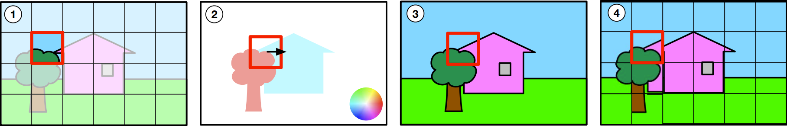
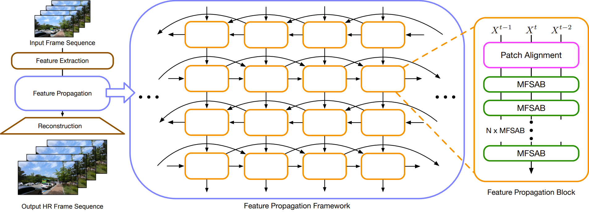
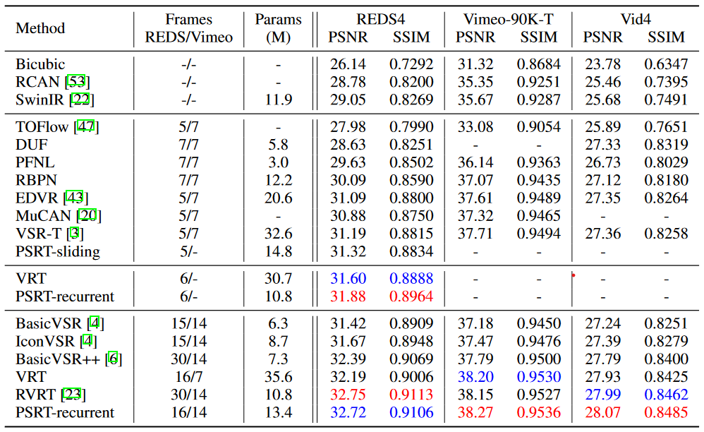

# Rethinking Alignment in Video Super-Resolution Transformers（NIPS 2022）
[Shuwei Shi*](https://scholar.google.com/citations?hl=en&user=2ZAstoQAAAAJ), [Jinjin Gu*](https://scholar.google.com/citations?hl=en&user=uMQ-G-QAAAAJ), [Liangbin Xie](https://liangbinxie.github.io), [Xintao Wang](https://scholar.google.com/citations?hl=en&user=FQgZpQoAAAAJ), [Yujiu Yang](https://scholar.google.com/citations?user=4gH3sxsAAAAJ&hl=en) and [Chao Dong](https://scholar.google.com.hk/citations?user=OSDCB0UAAAAJ&hl=zh-CN) <br>
[arxiv](https://arxiv.org/abs/2207.08494)
**|**
[pretrained models](https://drive.google.com/drive/folders/1SyCIPlCZp4SkORMaUVKzT0M07nDAhdrl?usp=sharing)
**|**
[visual results](https://drive.google.com/drive/folders/1SyCIPlCZp4SkORMaUVKzT0M07nDAhdrl?usp=sharing)

[](https://arxiv.org/abs/2207.08494)

[](https://github.com/XPixelGroup/RethinkVSRAlignment)

This repository is the official PyTorch implementation of "Rethinking Alignment in Video Super-Resolution Transformers"
([arxiv](https://arxiv.org/pdf/2207.08494.pdf),[pretrained models](https://drive.google.com/drive/folders/1SyCIPlCZp4SkORMaUVKzT0M07nDAhdrl?usp=sharing)). PSRT-recurrent ahcieves state-of-the-art performance in
- Video SR (REDS, Vimeo90K, Vid4)

> The alignment of adjacent frames is considered an essential operation in video super-resolution (VSR). Advanced VSR models, including the latest VSR Transformers, are generally equipped with well-designed alignment modules. However, the progress of the self-attention mechanism may violate this common sense. In this paper, we rethink the role of alignment in VSR Transformers and make several counter-intuitive observations. Our experiments show that: (i) VSR Transformers can directly utilize multi-frame information from unaligned videos, and (ii) existing alignment methods are sometimes harmful to VSR Transformers. These observations indicate that we can further improve the performance of VSR Transformers simply by removing the alignment module and adopting a larger attention window. Nevertheless, such designs will dramatically increase the computational burden, and cannot deal with large motions. Therefore, we propose a new and efficient alignment method called patch alignment, which aligns image patches instead of pixels. VSR Transformers equipped with patch alignment could demonstrate state-of-the-art performance on multiple benchmarks. Our work provides valuable insights on how multi-frame information is used in VSR and how to select alignment methods for different networks/datasets.
## Patch Alignment
<p align="center">
  
</p>

## Update
[2022/10/31] refine codes and release visual results.

## PSRT-recurrent
<p align="center">
  
</p>

## Requirements
> - Python 3.8, PyTorch >= 1.9.1
> - Requirements: see requirements.txt
> - Platforms: Ubuntu 18.04, cuda-11.1

## Quick Testing
Download [pretrained models](https://drive.google.com/drive/folders/1SyCIPlCZp4SkORMaUVKzT0M07nDAhdrl?usp=sharing) and put them in the appropriate folder. Prepare the [dataset](https://github.com/XPixelGroup/BasicSR/blob/master/docs/DatasetPreparation.md#Video-Super-Resolution) and change the file path in the inference code.

```bash
# download code
git clone https://github.com/XPixelGroup/RethinkVSRAlignment
cd RethinkVSRAlignment
pip install -r requirements.txt
pip install basicsr
python setup.py develop

# video sr trained on REDS, tested on REDS4
python inference_psrtrecurrent_reds.py

# video sr trained on Vimeo, tested on Vimeo

python inference_psrtrecurrent_vimeo90k.py --vimeo data/meta_info_Vimeo90K_train_GT.txt --device 0
```
## Training
Prepare the corresponding datasets follwing the quick test stage. For better I/O speed, you can follow [data prepare instruction](https://github.com/XPixelGroup/BasicSR/blob/master/docs/DatasetPreparation.md#Video-Super-Resolution) to convert `.png` datasets to `.lmdb` datasets.

```bash
# download code
git clone https://github.com/XPixelGroup/RethinkVSRAlignment
cd RethinkVSRAlignment
pip install -r requirements.txt
pip install basicsr
python setup.py develop

# video sr trained on REDS, tested on REDS4
bash dist_train.sh 8 options/4126_PSRTRecurrent_mix_precision_REDS_600K_N16.yml

# video sr trained on Vimeo, validated on Vid4

bash dist_train.sh 8 options/5123_PSRTRecurrent_mix_precision_Vimeo_300K_N14.yml
```
## Results
<p align="center">
  
</p>

## Citation
```
@article{shi2022rethinking,
  title={Rethinking Alignment in Video Super-Resolution Transformers},
  author={Shi, Shuwei and Gu, Jinjin and Xie, Liangbin and Wang, Xintao and Yang, Yujiu and Dong, Chao},
  journal={arXiv preprint arXiv:2207.08494},
  year={2022}
}

```
## Acknowledgment
Our codes was built on [BasicSR](https://github.com/XPixelGroup/BasicSR) and partially borrowed from [mmediting](https://github.com/open-mmlab/mmediting).
